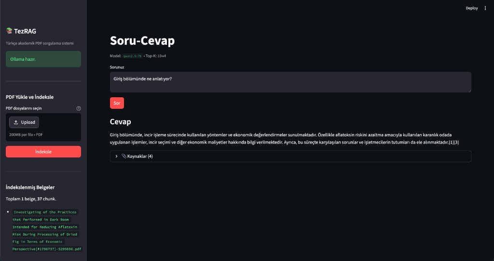

# TezRAG - Türkçe Akademik PDF Soru-Cevap (RAG)

[English](README.md) · **Türkçe**

[](https://www.python.org/)
[](LICENSE)

**TezRAG**, Türkçe akademik PDF belgeleri için **tamamen yerelde** çalışan bir **Retrieval-Augmented Generation (RAG)** uygulamasıdır. Belgeler vektör veritabanında tutulur; her soru için ilgili parçalar anlamsal olarak getirilir, ardından **yerel dil modeli** **Türkçe ve kaynaklara dayalı** cevap üretir. Üçüncü taraf LLM API anahtarı **gerektirmez** (çıkarım **Ollama** ile).

---

## Ekran görüntüsü



---

## Yetkinlikler ve neler sergileniyor?


| Alan                      | Bu projede neler var?                                                                              |
| ------------------------- | -------------------------------------------------------------------------------------------------- |
| **RAG pipeline**          | Soru → yoğun getirme → cross-encoder ile yeniden sıralama → bağlama dayalı üretim                  |
| **Vektör depolama**       | ChromaDB (kalıcı), kosinüs benzerliği, HNSW                                                        |
| **Embedding**             | `multilingual-e5-base` ; model gereksinimine uygun `query:` / `passage:` önekleri                  |
| **Reranking**             | `bge-reranker-v2-m3` ile adayların yeniden puanlanması (iki aşamalı retrieve + rerank)             |
| **Veri hazırlığı**        | PDF’ten metin (pdfplumber, gerekirse pypdf), Türkçe odaklı chunk’lama, sayfa ve kaynak metadata’sı |
| **İdempotent indeksleme** | Dosya imzası ile değişmeyen PDF’lerin tekrar işlenmesinin önlenmesi                                |
| **LLM entegrasyonu**      | Ollama HTTP API (`/api/generate`), yapılandırılabilir model ve seçenekler                          |
| **Prompt tasarımı**       | Numaralı atıf, bağlam dışı halüsinasyonu azaltan kurallar (Türkçe akademik üslup)                  |
| **Arayüz**                | Streamlit: PDF yükleme, indeksleme, soru-cevap, kaynak gösterimi                                   |


> **Tek cümle:** Türkçe belgeler için uçtan uca RAG ; indeksleme, anlamsal getirme, yeniden sıralama ve yerel LLM üretimi tek yapıda.

---

## Mimari (özet)

```text
PDF → metin çıkarımı → chunk (+ metadata)
                    ↓
            Embedding (E5, passage:)
                    ↓
            ChromaDB (vektör arama, top-k)
                    ↓
            Cross-encoder rerank (top-k → top-n)
                    ↓
            Prompt + bağlam → Ollama (yerel LLM) → Türkçe cevap + kaynak listesi
```

---

## Teknoloji yığını


| Bileşen                | Seçim                                                                 |
| ---------------------- | --------------------------------------------------------------------- |
| Orchestration / arayüz | Streamlit                                                             |
| Vektör veritabanı      | ChromaDB                                                              |
| Embedding              | Sentence Transformers ; `intfloat/multilingual-e5-base`               |
| Reranker               | CrossEncoder ; `BAAI/bge-reranker-v2-m3`                              |
| PDF                    | pdfplumber, pypdf (yedek)                                             |
| Chunking               | LangChain `RecursiveCharacterTextSplitter` (Türkçe odaklı ayırıcılar) |
| LLM                    | Ollama (varsayılan: `qwen2.5:7b`)                                     |
| Yapılandırma           | `python-dotenv`, `src/config.py`                                      |


---

## Öne çıkanlar

- **Gizlilik ve maliyet:** Belgeler ve embedding/reranker modelleri yerelde; zorunlu bulut LLM API’si yok.
- **İki aşamalı retrieval:** Geniş aday kümesi (ör. 10) → daha küçük kümeye rerank (ör. 4), daha keskin bağlam.
- **Türkçe odaklı chunking:** Cümle/paragraf sınırlarına saygı; akademik soru-cevap için ayarlanabilir boyut ve örtüşme.
- **Kaynak şeffaflığı:** Arayüzde dosya, sayfa ve rerank skorları gösterilebilir.
- **CLI indeksleme:** `scripts/index_pdfs.py` ile toplu yükleme; Streamlit ile etkileşimli yükleme.

---

## Gereksinimler

- **Python 3.11+**
- **[Ollama](https://ollama.com)** kurulu ve çalışır durumda (`ollama serve`)
- İlk çalıştırmada embedding ve reranker modelleri Hugging Face’ten iner (açık ağırlıklar için API anahtarı gerekmez)

---

## Kurulum

```bash
git clone <TezRAG>
cd <klonlanan-klasör>

python3.11 -m venv .venv
source .venv/bin/activate   # Windows: .venv\Scripts\activate
pip install -r requirements.txt

cp .env.example .env          # İsteğe bağlı; varsayılanlar çoğu zaman yeterlidir
```

Örnek Ollama modeli:

```bash
ollama pull qwen2.5:7b
```

---

## Kullanım

**1) PDF ekleme**

PDF’leri `data/pdfs/` altına kopyalayın veya uygulama kenar çubuğundan yükleyin.

**2) İndeksleme (CLI)**

```bash
python -m scripts.index_pdfs data/pdfs/
```

**3) Arayüzü başlatma**

```bash
streamlit run app.py
```

Tarayıcıdan soru sorun; önce en az bir PDF indekslenmiş olmalıdır. Ollama’ya erişilemezse kenar çubuğunda uyarı çıkar ; sunucunun çalıştığından emin olun (`ollama serve`).

---

## Yapılandırma


| Ayar                   | Varsayılan | Not                                   |
| ---------------------- | ---------- | ------------------------------------- |
| Chunk boyutu / örtüşme | 800 / 150  | `src/config.py` içinde düzenlenebilir |
| Retrieval → rerank     | 10 → 4     | `top_k_retrieval`, `top_k_rerank`     |
| LLM sıcaklığı / token  | 0.2 / 1024 | Üretim davranışı                      |


`.env` ile geçersiz kılınabilir; şablon değişkenleri için `.env.example` dosyasına bakın.

---

## Proje yapısı

```text
├── app.py                 # Streamlit uygulaması
├── scripts/
│   └── index_pdfs.py      # Toplu PDF indeksleme
├── src/
│   ├── config.py          # Ortam ve hiperparametreler
│   ├── ingestion.py       # PDF → chunk → ChromaDB
│   ├── retriever.py       # Embedding, sorgu, rerank
│   ├── generator.py       # Ollama ile cevap üretimi
│   └── rag_pipeline.py    # Pipeline birleştirme
├── data/pdfs/             # PDF’ler buraya (*.pdf gitignore)
├── chroma_db/             # Yerel vektör deposu (gitignore)
├── docs/
│   └── tezrag-ui.png      # README ekran görüntüsü
├── requirements.txt
├── .env.example
└── LICENSE
```

---

## Lisans

Bu proje [MIT Lisansı](LICENSE) altında yayınlanır.